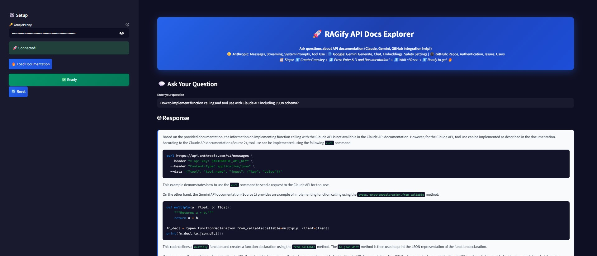
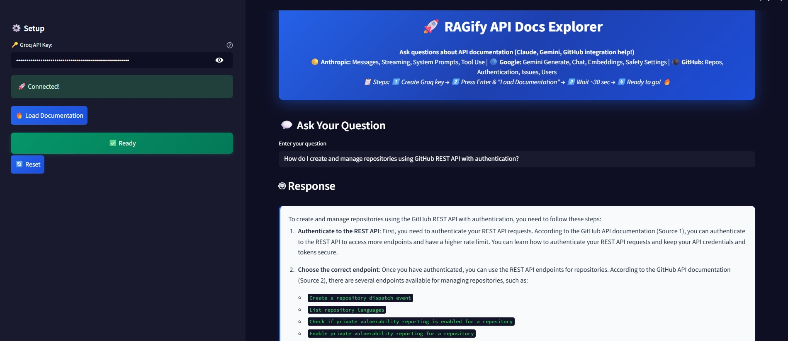

# 🚀 RAGify API Docs Explorer

An advanced RAG-powered assistant that helps developers instantly find answers from API documentation using Retrieval-Augmented Generation. Supports Stripe, GitHub, and Twilio APIs with intelligent semantic search and vector embeddings.

## 📸 Screenshots

<p align="center">
  
  
</p>

## ⚡ Features

- 🧠 **RAG Architecture** - Advanced retrieval-augmented generation with ChromaDB vector storage
- 🔍 **Semantic Search** - AI-powered similarity search through embedded documentation
- ⚡ **Lightning Fast** - Groq's optimized inference for sub-second responses
- 💻 **Code Examples** - Practical implementation guides with real API code
- 🔄 **Multi-API Support** - Stripe, GitHub, and Twilio documentation unified
- 💬 **Contextual Chat** - Conversation memory for follow-up questions
- 📖 **Source Attribution** - Always cites original documentation sources

## 🚀 Quick Start

### Prerequisites

- Python 3.8+
- Free Groq API key from [console.groq.com](https://console.groq.com)

### Installation

1. **Clone the repository**
   ```bash
   git clone https://github.com/yourusername/ragify-api-docs-explorer.git
   cd ragify-api-docs-explorer
   ```

2. **Install dependencies**
   ```bash
   pip install -r requirements.txt
   ```

3. **Run RAGify**
   ```bash
   streamlit run app.py
   ```

4. **Setup Process**
   - 1️⃣ Enter your Groq API key in the sidebar
   - 2️⃣ Click "📥 Load Documentation" 
   - 3️⃣ Wait ~1 minute for RAG processing
   - 4️⃣ Start exploring API docs! 🔥

## 🤔 Example Queries

- "How do I create a payment intent with Stripe?"
- "What webhook events does GitHub support?"
- "Send SMS using Twilio API with authentication"
- "GitHub repository management best practices"
- "Stripe subscription lifecycle management"

## 🏗️ RAG Architecture

```
ragify-api-docs-explorer/
├── src/
│   ├── __init__.py          # Package initialization
│   ├── scraper.py           # Intelligent web scraping
│   ├── embeddings.py        # Vector embeddings + ChromaDB
│   ├── rag.py              # RAG implementation + Groq LLM
│   └── utils.py            # Configuration utilities
├── app.py                  # Streamlit RAGify interface
├── requirements.txt        # Python dependencies
└── README.md              # This documentation
```

## 🔧 Technical Components

### 🕷️ Smart Scraper (`scraper.py`)
- Intelligent content extraction from API documentation
- Rate limiting and robust error handling
- Clean text preprocessing for optimal embeddings

### 🧠 Vector Embeddings (`embeddings.py`)
- Sentence Transformers: `all-MiniLM-L6-v2` (384-dim embeddings)
- ChromaDB persistent vector database
- Smart chunking with overlap for context preservation

### 🤖 RAG Engine (`rag.py`)
- Retrieval-augmented generation with Groq Llama 3.3 70B
- Contextual conversation memory
- Optimized prompts for API documentation queries

## 🌐 Supported API Documentation

| API | Coverage | Use Cases |
|-----|----------|-----------|
| 💳 **Stripe** | Payments, Customers, Subscriptions, Billing | Payment processing, recurring billing |
| 🐙 **GitHub** | Repositories, Issues, Webhooks, Authentication | CI/CD, repo management, integrations |
| 📱 **Twilio** | SMS, Voice, Messaging, Programmable Communications | Notifications, voice calls, messaging |

## ⚙️ Configuration

### Environment Variables
```bash
GROQ_API_KEY=your_groq_api_key_here
```

### Extending RAGify
Add new API documentation in `src/utils.py`:
```python
API_DOCS_URLS = {
    "your_api": [
        "https://docs.yourapi.com/getting-started",
        "https://docs.yourapi.com/api-reference"
    ]
}
```

## 📊 Performance Metrics

- **Embedding Model**: Sentence-BERT `all-MiniLM-L6-v2` (free, 384 dimensions)
- **LLM**: Groq Llama 3.3 70B (optimized inference)
- **Vector Database**: ChromaDB with persistent storage
- **Query Response Time**: < 2 seconds average
- **Similarity Search**: Cosine similarity with top-k retrieval

## 🤝 Contributing

1. Fork the repository
2. Create feature branch (`git checkout -b feature/rag-enhancement`)
3. Commit changes (`git commit -m 'Add RAG feature'`)
4. Push branch (`git push origin feature/rag-enhancement`)
5. Open Pull Request

## 📝 License

This project is licensed under the MIT License - see the [LICENSE](LICENSE) file for details.

## 🙏 Technology Stack

- **[Groq](https://groq.com)** - Ultra-fast LLM inference
- **[ChromaDB](https://www.trychroma.com/)** - Vector database for embeddings
- **[Sentence Transformers](https://www.sbert.net/)** - State-of-the-art embeddings
- **[Streamlit](https://streamlit.io/)** - Rapid web app development

## 🐛 Issues & Feature Requests

Found a bug or want to request a RAG enhancement? Open an issue on GitHub!

## ⭐ Show Your Support

Star this repository if RAGify helped accelerate your API integration work!